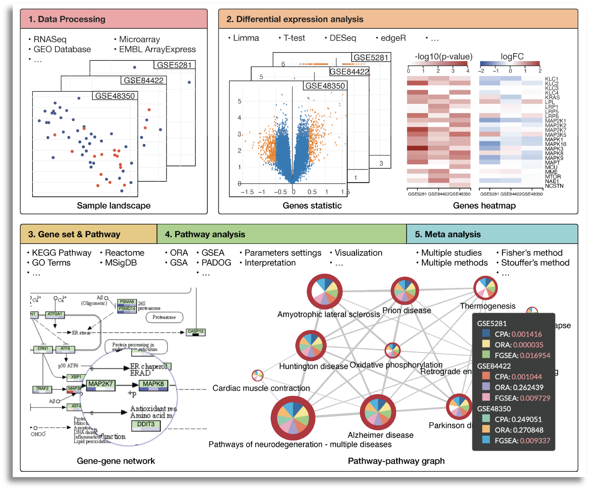

# Consensus Pathway Analysis using Google Cloud Infrastructure

## <a name="overview">Overview</a>
This cloud-based learning module is specialized for pathway analyses using omics datasets to discover consistent 
biological mechanism behind a condition. The content will be arranged in five sub-modules which allows us to:
1. Download and process data from public repositories
2. Perform differential analysis
3. Perform pathway analysis using different methods that seek to answer different research hypotheses
4. Perform meta-analysis and combine methods and datasets to find consensus results
5. Interactively explore significantly impacted pathways across multiple analyses, and browsing relationships between 
pathways and genes.

Each learning sub-modules will be organized in a R Jupyter notebook to help the participants familiarize themselves 
with the cloud computing in the specific context of running bioinformatics workflows. Each notebook will include 
step-by-step hand-one practice with R command line to install necessary tools, obtain data, perform analysis, visualize 
and interpret the results.

This learning module does require any computational hardware and local environment setting from users. However, 
users need to have Google email account, sufficient internet access, and a stardard web-browser (e.g. Chrome, Edge, 
Firefox etc., Chrome browser is recommended) to create a cloud virtual machine for analysis.

## <a name="content">Content</a>
The content of the course is organized in R Jupyter Notebook. Then we use Jupyter Book which is a package to combine 
individuals Jupyter Notebooks into a web-interface for a better navigation. Details of installing the tools and formatting
the content can be found at: https://jupyterbook.org/en/stable/intro.html. The content of the course is deposited to 
Dr. Tin Nguyen Github repository at https://github.com/tinnlab/NOSI-Google-Cloud-Training.

The Jupyter Book will run and test all codes in our notebooks and then build them into a website format. 
The website output is the `_build/html` folder in the repository. After the `_build/html` is completely built, the web version
of the book will be uploaded the `_build/html` folder to a Google bucket. 
The address of the cloud bucket can be found at: https://storage.googleapis.com/nosi-gcloud-course/html/intro.html. 
The link http://tinnguyen-lab.com/course/cpa-gcloud/intro.html is just a proxy to that link using Dr. Tin Nguyen domain 
name.

A completed workflow from setting up the environment, building the book, to uploading the website to 
Google cloud bucket here: https://github.com/tinnlab/NOSI-Google-Cloud-Training/blob/main/.github/workflows/main.yml. 
The logs for each time it builds the book are here: https://github.com/tinnlab/NOSI-Google-Cloud-Training/actions

