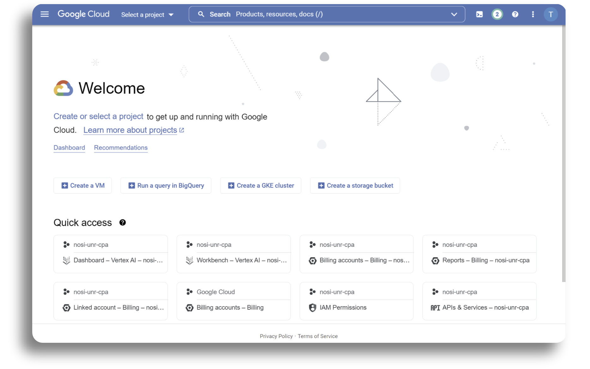
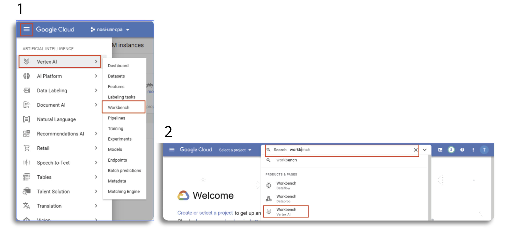
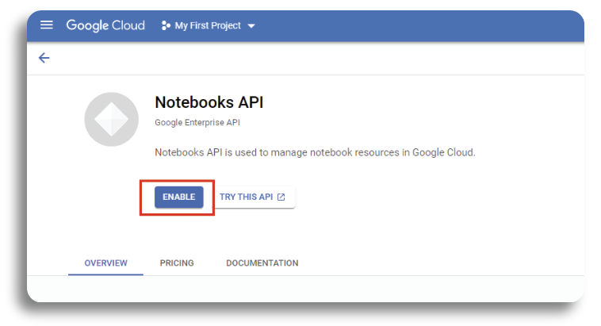
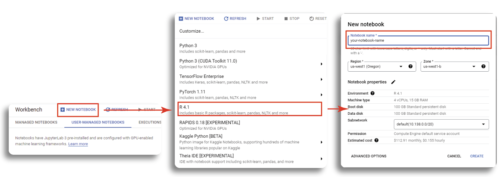
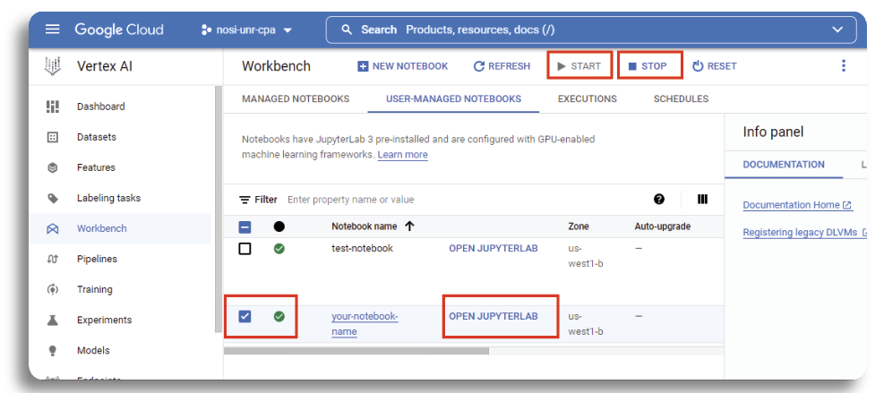

# Setting up Google Cloud environment

## Signing in Google Cloud Platform
You can begin by first navigating to https://console.cloud.google.com/ and logging in with your credentials. 

After a few moments, the GCP console opens with following dashboard.

## Navigating to the Vertex AI Workbench

Once the login process is done, we can create a virtual machine for analysis using Vertex AI Workbench. There are two ways to navigate to Vertex AI. In the first method, we can click the __Navigation menu__ at the top-left, next to “Google Cloud Platform”. Then, navigate to <a href="https://console.cloud.google.com/vertex-ai">Vertex AI</a> and select <a href="https://console.cloud.google.com/vertex-ai/workbench">Workbench</a>. In the second method, we can 
 go to __Google Cloud Console Menu__ in the __Search products and resources__, enter "Workbench" and then select __Workbench Vertex AI__.

If it isn't already enabled we click __Enable__ to start using the API.

## Creating a Virtual Machine

Within the Workbench screen, click __MANAGED NOTEBOOKS__, select the region which is closed to your physicall location and click __CREATE NOTEBOOK__. Since our analyses will be based on R programing language, we need to select R 4.1 as our development environment. Then, set a name for your virutal machine and select the server which is closed to you physical location. In our learning module, a default machine with 4 vCPUS and 15GB RAM would be suffice. Finally, click __CREATE__ to get the new machine up and running.

Creating a machine may take a few minutes to finish and you should see a new notebook with your designed name appears within the workbench dashboard when the process is completed. 

To start the virtual machine, select your notebook in the __USER-MANAGED NOTESBOOK__ and click on __START__ button on the top menu bar. The starting process might take up to several minutes. When it is done, the green checkmark indicates that your virtual machine is running.  Next, clicking __OPEN JUPYTER LAB__ to access the notebook.

## Downloading and Running Tutorial Files

Now that you have successfully created your virtual machine, and you will be directed to Jupyterlab screen. 
The next step is to import our CPA's notebooks start the course. 
This can be done by selecting the __Git__ from the top menu in Jupyterlab, and choosing the __Clone a Repository__ option. 
Next you can copy and paste in the link of repository: "https://github.com/tinnlab/NOSI-Google-Cloud-Training.git" (without quotation marks) and click __Clone__.

This should download our repository to Jupyter Lab folder. All tutorial files for five sub-moudule are in Jupyter format with *.ipynv* extension . Double click on each file to view the lab content and running the code. This will open the Jupyter file in Jupyter notebook. From here you can run each section, or 'cell', of the code, one by one, by pushing the 'Play' button on the above menu.

Some 'cells' of code take longer for the computer to process than others. You will know a cell is running when a cell has an asterisk next to it \[\*\]. When the cell finishes running, that asterisk will be replaced with a number which represents the order that cell was run in. You can now explore the tutorials by running the code in each, from top to bottom. Look at the 'workflows' section below for a short description of each tutorial.

Jupyter is a powerful tool, with many useful features. For more information on how to use Jupyter, we recommend searching for Jupyter tutorials and literature online.

### Stopping Your Virtual Machine

When you are finished running code, you should turn off your virtual machine to prevent unneeded billing or resource use by checking your notebook and pushing the __STOP__ button.

